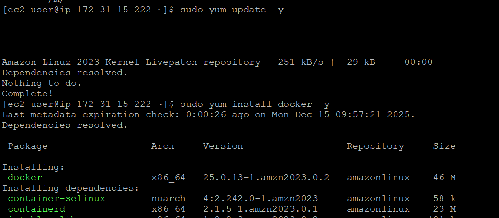
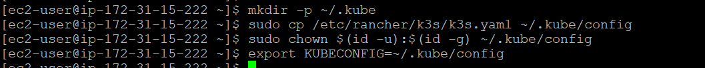
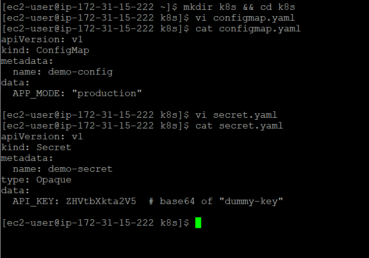
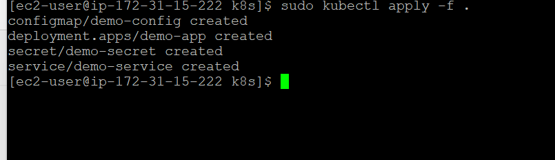
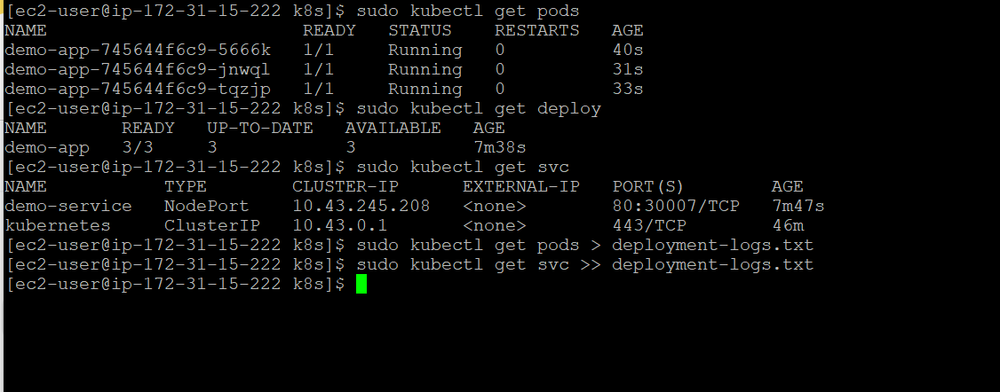

# Screenshots

This document contains proof of all the important screenshots of including setup, monitoring, troubleshoting and outputs.

---

## **1. Setup docker and verify**

---

## **2. Clone Repository**

---

## **3. Setup Docker**

---

## **4. Verify Docker is running**

---

## **5. Build Docker Image**

---

## **6. Run container, verify and access locally**

---

## **7. Access externally**

---

## **8. Verify logs**

---

## **9. Build image for docker hub and push**

---
## **10. Verify Image is available on docker hub**

---
