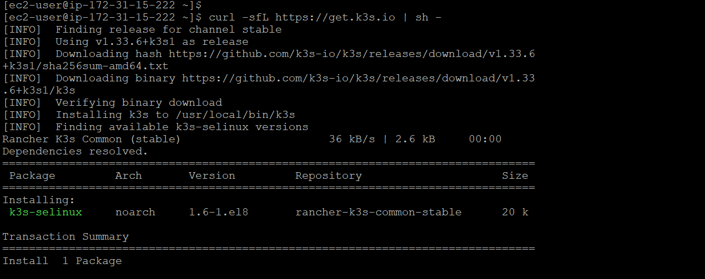
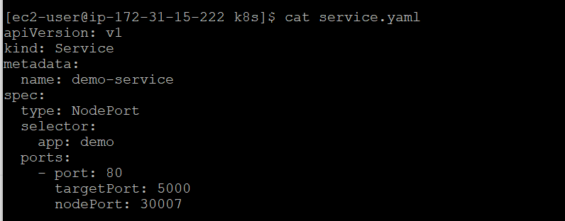
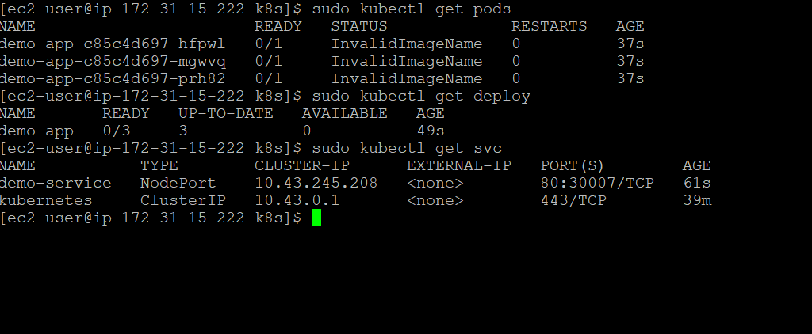
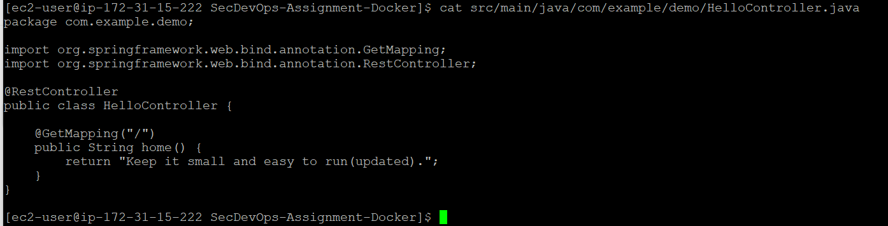
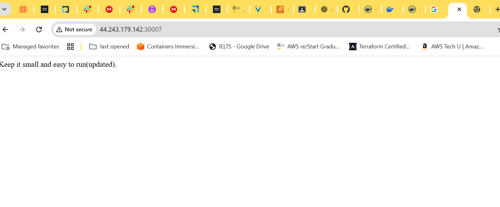
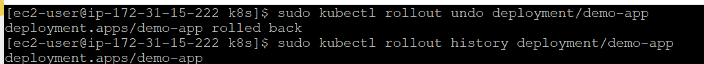
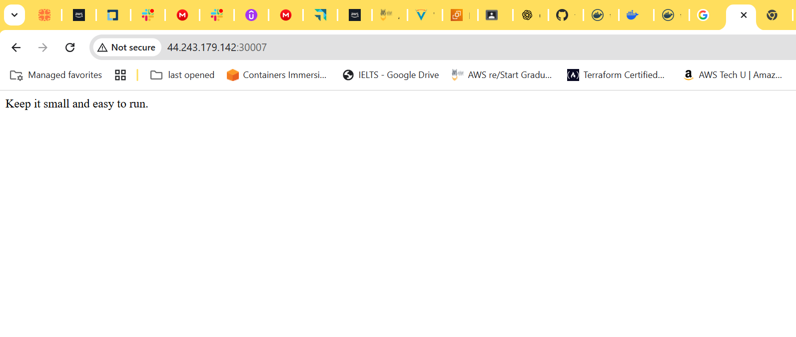
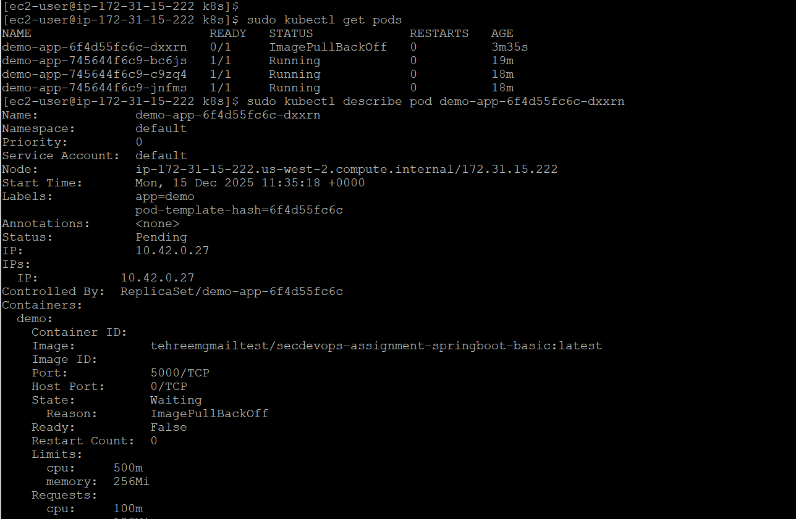
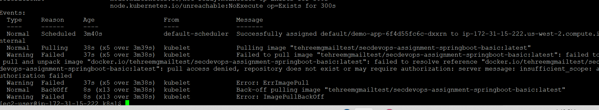

# Screenshots

This document contains proof of all the important screenshots of including setup, monitoring, troubleshoting and outputs.

---

## **1. Setup docker and verify**

---

## **2. Install k3s**

---

## **3. Verify cluster**

---

## **4. Allow kubectl without sudo**

---

## **5. Verify**

---

## **6. Kubernetes Manifests**

---

## **7. Deploy and Verify**

---

## **8. Access externally on port 30007 to Verify**

---

## **9. Scale Deployment and Verify**

---

## **10. Modify the app rebuild and push the image again on docker hub**

---

## **11. Rolling Update**

---

## **12. Verify Update**

---

## **13. Rollback and Access again to see previous version**

---

## **13. Rollback and Access again to see previous version**

---

## **14. Change configuration to produce some error and deploy again**

---

## **15. Inspect and troublshoot the error**

---

## **16. Fix, deploy again and verfiy everything is set**

---

## **17. Capture all the logs in a text file**

---
